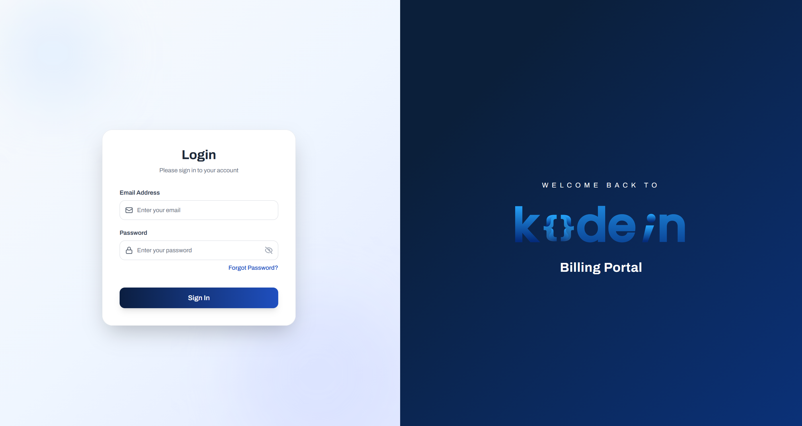
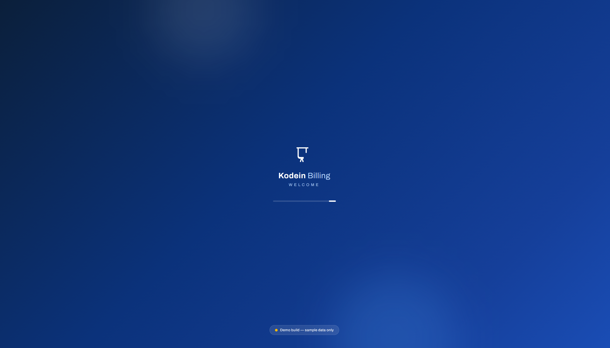
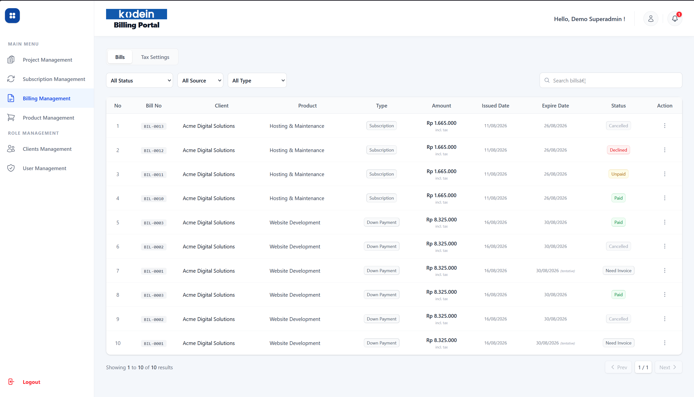
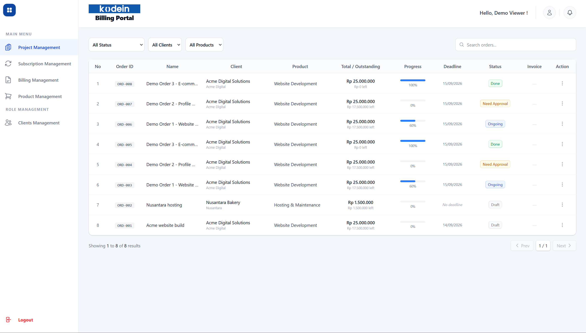
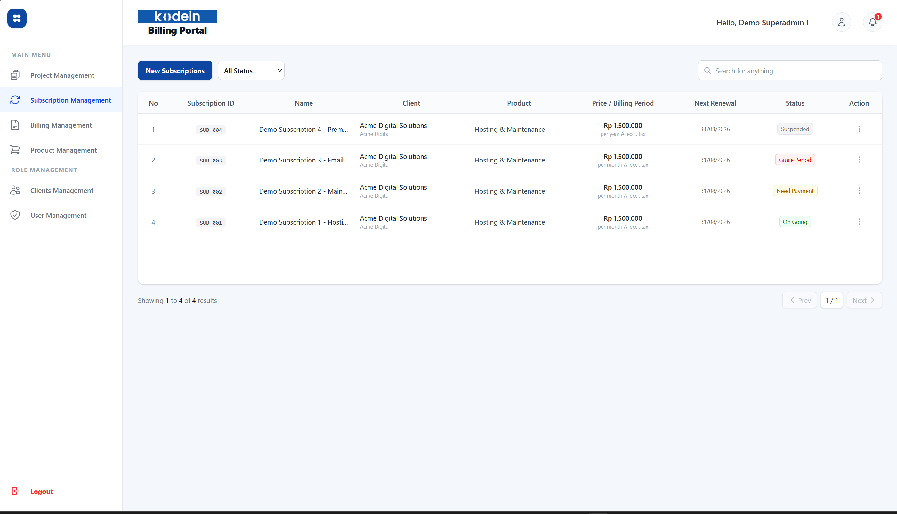
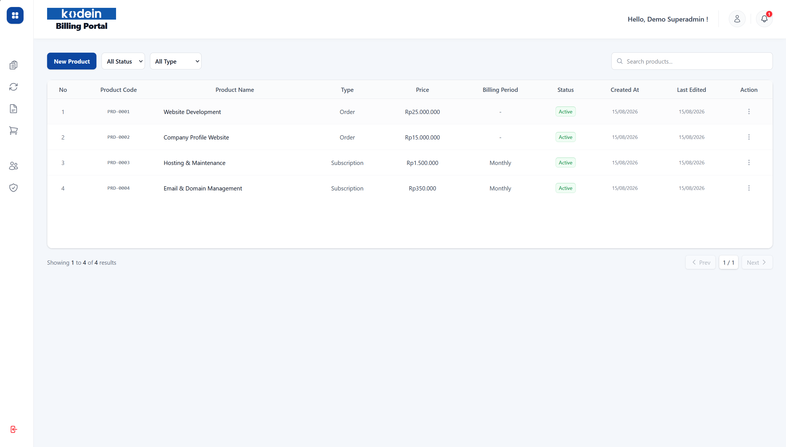

# 🧾 Kodein Billing System

> A billing, subscription, and invoicing management platform built during my time at **Kodein**.

## 📸 Screenshots

| Login | Dashboard | Billing |
|---|---|---|
|  |  |  |

| Orders | Subscriptions | Products |
|---|---|---|
|  |  |  |

> Screenshots are also available in the [`screenshots/`](screenshots/) folder for a closer look.

---

## 🎯 What Is Kodein Billing System

Kodein Billing System is an internal platform that gives the team one place to manage the full lifecycle of a client project ΓÇö from order approval and progress tracking, to recurring subscriptions and invoicing.

It replaces a manual, spreadsheet-based workflow with a single dashboard where the team can see what is in progress, what needs approval, and what is due for payment ΓÇö all in real time.

> **Demo build.** All data shown is sample data for illustrative purposes only.

---

## 🏢 Why This Was Built

This platform was developed to support the internal operations of [**Kodein**](https://kodein.co.id) ΓÇö an Indonesian IT company that designs, develops, and hosts websites and mobile applications for businesses across Indonesia. See [Kodein's portfolio](https://kodein.co.id/portofolio) for examples of the company's work.

---

## ✨ Features

- 📦 **Project Management** — create and approve project orders with configurable down payments, track progress milestones, and attach files along the way
- 🔁 **Subscription Management** — recurring subscriptions with weekly / monthly / annual billing periods, automatic renewal tracking, and a full grace-period → suspension → re-billing lifecycle
- 💳 **Billing & Payments** — automatic bill generation, invoice and proof-of-payment uploads, approve / decline / refund (credit note) workflows, and tax support
- 📄 **Invoice PDF** — generate a clean, secure invoice PDF on demand
- 🔔 **Notifications** — in-app alerts for approvals, renewals, and expiring bills
- 👥 **Role-based Access** — roles for admin, finance, marketing, client, and a read-only viewer

---

## 🛠 Built With

- ⚛️ **Next.js** — App Router, React, TypeScript
- 🎨 **Tailwind CSS** — UI styling
- 🗄️ **PostgreSQL** — relational database
- 🔐 **JWT** — secure session handling with rotating tokens
- ☁️ **Vercel** — hosting and scheduled jobs

---

## 🚀 Live Demo

Open the live demo: **[https://kodein-billing-system.vercel.app](https://kodein-billing-system.vercel.app)**

One account is open for public testing, and it is read-only:

| Role | Email | Password |
|---|---|---|
| Viewer | `viewer@example.com` | `Demo@123` |

The viewer can browse every module but cannot create, edit, delete, approve, or upload anything.

### 👥 Roles

The system supports five roles besides the viewer. Credentials for these roles are deliberately not published; they belong to the internal team.

| Role | Capabilities |
|---|---|
| Superadmin | Full access across every module, including user management and deletions |
| Admin | Manages most modules; user management is limited to creating accounts |
| Marketing | Manages orders and subscriptions |
| Finance | Manages payments, bills, and invoices; read-only on clients and products |
| Client | Sees only its own bills and orders |
| Viewer | Read-only across every module; all action buttons are hidden |

---

## 🔒 Security

Security best practices are applied throughout the platform ΓÇö from secure session management and access control on every endpoint, to safe file handling and hardened web headers.

---

## 📄 License

This project is licensed under the MIT License ΓÇö see the [LICENSE](LICENSE) file for details.

---

## 👤 Author

**Melvin** ([@CodeMelvin](https://github.com/CodeMelvin))
